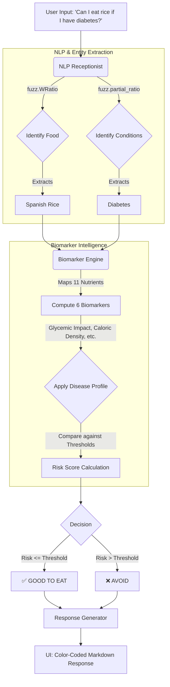

# AI Food Advisor: Your Personal AI Nutritionist 🥗

Navigating dietary choices with a health condition can be confusing and stressful, often leading to reliance on generic, impersonal advice. The **AI Food Advisor** tackles this challenge head-on, providing an instant, personalized, and data-driven conversational chatbot specifically designed to answer the critical question: *"Can I eat this?"*

This application moves beyond simple lookups with a powerful **"Two-Brain" AI architecture**. 
1. **Conversational "Receptionist" (NLP):** Uses fuzzy string matching to effortlessly understand natural language, typos, and phrasing variations. 
2. **"Expert" Biomarker Engine:** A highly scalable, abstract layer that evaluates food safety based on underlying nutritional biomarkers rather than hardcoded rules, making it inherently future-proof for new diseases.

---

## 🚀 The Architecture (Flowchart)



---

## 🔮 Why This System is "Future-Proof"

Traditional machine learning models (like our fallback XGBoost implementation) require you to retrain an entire model every time you want to support a new disease. If a new dataset arrives, or a new disease needs to be supported, you are forced to re-run your ML pipelines.

**The Biomarker Engine changes everything:**
Instead of mapping `Food -> Disease` directly, it maps `Food -> Biomarkers -> Disease`. 
1. **Universal Biomarkers:** It computes 6 universal scores (e.g., *Glycemic Impact*, *Cardiovascular Strain*, *Inflammatory Index*) from 11 raw nutritional features (Calories, Sodium, Fats, etc.).
2. **Plug-and-Play Diseases:** To add a new disease, you simply define its "Risk Profile" (e.g., Hypertension is 75% Cardiovascular Strain + 25% Inflammatory Index). **Zero model retraining is required.**
3. **Auto-Calibration:** When the system starts, it scans the dataset and automatically calibrates the risk thresholds for all diseases.

This abstraction allows the system to instantly support *Obesity*, *Kidney Disease*, and *PCOD/PCOS* without needing a single new ML model.

---

## ✨ Features
* **Conversational Interface:** Chat naturally. Say *"hello"*, ask *"i love rice but i have diabeties"*, and the bot understands the context.
* **Intelligent Typo Handling:** Powered by `thefuzz`, it easily corrects typos (e.g., "diabeties" -> "diabetes") and finds partial food matches.
* **Rich Markdown Explanations:** Doesn't just say "Yes" or "No". It explains *why* based on Biomarker levels (e.g., High Glycemic Impact) and lists key nutrients.
* **Beautiful UI:** A stunning, modern, glassmorphism UI built with Tailwind CSS, featuring floating animations, typing indicators, and color-coded verdicts.
* **Supports 7 Health Conditions:** Diabetes, Hypertension, Hyperlipidemia, Thyroid Disorder, Obesity, Kidney Disease, and PCOD.

---

## 🛠️ Technologies & Libraries

* **Backend:** `Flask` (Python)
* **NLP / Fuzzy Matching:** `thefuzz` (formerly FuzzyWuzzy), `python-Levenshtein`
* **Data Processing:** `pandas`, `numpy`
* **Machine Learning (Fallback/Validation):** `xgboost`, `scikit-learn`, `joblib`
* **Frontend:** `HTML5`, `Vanilla JavaScript`, `Tailwind CSS` (via CDN)
* **Markdown Rendering:** `Showdown.js`

---

## ⚙️ How to Run Locally

### 1. Install Dependencies
Ensure you have Python 3.8+ installed. Install the required libraries using pip:
```bash
pip install -r requirements.txt
```

*(Note: `requirements.txt` should include `flask`, `flask-cors`, `pandas`, `numpy`, `thefuzz`, `python-Levenshtein`, `xgboost`, `scikit-learn`, `joblib`)*

### 2. (Optional) Run the Training & Validation Script
If you want to train the fallback XGBoost models and see a side-by-side accuracy comparison between XGBoost and the Biomarker Engine:
```bash
python train_nutrition_model.py
```

### 3. Start the Backend Server
Run the Flask API:
```bash
python main.py
```
The server will start on `http://127.0.0.1:5000`.

### 4. Open the Web App
Simply double-click the `index.html` file to open it in your web browser. Start chatting with your AI Nutritionist!
